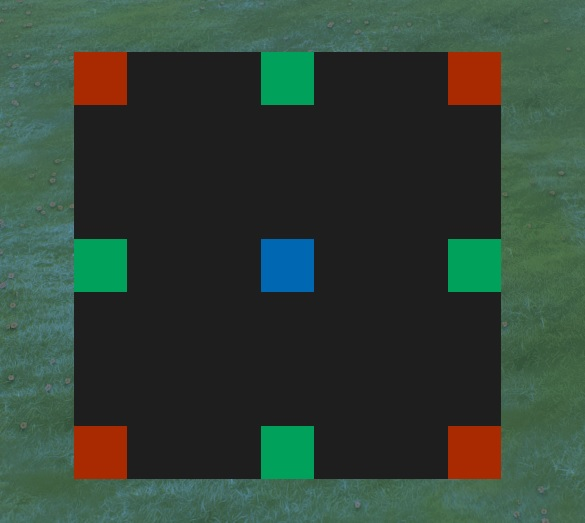
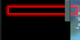
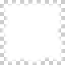
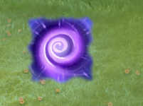

# CSS

本篇讲解PUI的CSS与HTML的CSS不一样的地方，同时也默认你已经对HTML有一定的了解，毕竟PUI是借鉴HTML的，
即使如此还是有很大的不同。

## 变量

比较意外的是PUI的CSS是支持定义变量的，然而比较鸡肋，就是定义变量而已，连运算都不支持。

```scss
@define baseColor: #A5ADA2ff;
.style {
    color: baseColor;
}
```

## 支持的伪选择器

比较蛋疼的是不支持`:first-child` `:last-child` `:nth()`这些可以选择子元素的选择器，
PUI中的元素也是不存在`:before`和`:after`，也不支持属性选择器。

```css
:hover
:focus
:active /* Button元素才有用 */
:disabled
:enabled
:selected
:inspect /* 表示该元素处于用debugger查看的状态 */
:descendantfocus /* 表示该元素的子元素获得焦点 */
:parentdisabled /* 表示该元素的父元素为禁用状态 */
:layoutloading  /* 表示元素加载中的状态，比如加载中显示loading文字，加载完就消失 */
:layoutfailed /* 表示元素加载失败的状态 */
:activationdisabled /* 表示面板被禁用后依然可以获取焦点等 */
:not()
```

## 排版

PUI的元素不像HTML的元素一样分`inline`和`block`等等这些属性，PUI的所有元素一致都是定位在父类的左上角。

PUI的排版也较为简单，只需要CSS中定义`flow-children`，当然这个是PUI特有的，这个是决定子元素是如何排版的

`flow-children`有以下值

| 值           | 描述     |
| ------------ | -------- |
| none         | 默认，无  |
| down         | 竖直排版  |
| right        | 水平排版  |
| right-wrap   | 水平排版，超过父类边界的子元素自动换行 |

*例*

```xml
<Panel style="flow-children:right;">
			
    <!-- 第一列 -->
    <Panel style="margin-right:50px;">
        <Panel style="width:64px;height:64px;background-color:#900;" />
        <Panel style="width:32px;height:32px;background-color:#090;" />
        <Panel style="width:16px;height:16px;background-color:#009;" />
    </Panel>

    <!-- 第二列 -->
    <Panel style="margin-right:50px;flow-children:down;">
        <Panel style="width:64px;height:64px;background-color:#900;" />
        <Panel style="width:32px;height:32px;background-color:#090;" />
        <Panel style="width:16px;height:16px;background-color:#009;" />
    </Panel>

    <!-- 第三列 -->
    <Panel style="margin-right:50px;flow-children:right;">
        <Panel style="width:64px;height:64px;background-color:#900;" />
        <Panel style="width:32px;height:32px;background-color:#090;" />
        <Panel style="width:16px;height:16px;background-color:#009;" />
    </Panel>

    <!-- 第四列 -->
    <Panel style="margin-right:50px;flow-children:right-wrap;width:100px;">
        <Panel style="width:64px;height:64px;background-color:#900;" />
        <Panel style="width:32px;height:32px;background-color:#090;" />
        <Panel style="width:16px;height:16px;background-color:#009;" />
    </Panel>

</Panel>
```


## 定位

PUI中可以使用`position`,`x`,`y`,`transform`来改变位置，当然这是相对父类来定位;

定位在右下角，垂直居中这些也很简单，关键的两个属性`vertical-align`和`horizontal-align`

*注意：*

- 如果父类是竖直排版，子元素应该只使用`horizontal-align`
- 如果父类是水平排版，子元素应该只使用`vertical-align`

`vertical-align`的值

| 值           | 描述         |
| ------------ | ------------ |
| top          | 默认，顶部    |
| bottom       | 顶部         |
| center       | 垂直居中     |
| middle       | 等同于center |

`horizontal-align`的值

| 值           | 描述         |
| ------------ | ------------ |
| left         | 默认，左      |
| right        | 右           |
| center       | 水平居中     |
| middle       | 等同于center |

*例*

- XML

```xml
<Panel hittest="false" class="ExmpleRoot" >
	<Panel id="ExmpleFrame" >
		<!-- 左上角 -->
		<Panel class="top-left red" />

		<!-- 顶部水平居中 -->
		<Panel class="top-center green" />

		<!-- 右上角 -->
		<Panel class="top-right red" />

		<!-- 左垂直居中 -->
		<Panel class="middle-left green" />

		<!-- 居中 -->
		<Panel class="middle-center blue" />

		<!-- 右垂直居中 -->
		<Panel class="middle-right green" />

		<!-- 左下角 -->
		<Panel class="bottom-left red" />

		<!-- 底部水平居中 -->
		<Panel class="bottom-center green" />

		<!-- 右下角 -->
		<Panel class="bottom-right red" />
	</Panel>
</Panel>
```

- CSS

```css
.ExmpleRoot{
	width: 100%;
	height: 100%;
}

#ExmpleFrame {
	width: 512px;
	height: 512px;
	background-color: #1e1e1e;
	horizontal-align: center;
	vertical-align: middle;
}

#ExmpleFrame > Panel {
	width: 64px;
	height: 64px;
}

.red{
	background-color: #A92900;
}

.green{
	background-color: #00A15A;
}

.blue{
	background-color: #0068B3;
}

.top-left {
	vertical-align: top;
	horizontal-align: left;
}

.top-center {
	vertical-align: top;
	horizontal-align: center;
}

.top-right {
	vertical-align: top;
	horizontal-align: right;
}

.middle-left {
	vertical-align: middle;
	horizontal-align: left;
}

.middle-center {
	vertical-align: middle;
	horizontal-align: center;
}

.middle-right {
	vertical-align: middle;
	horizontal-align: right;
}

.bottom-left {
	vertical-align: bottom;
	horizontal-align: left;
}

.bottom-center {
	vertical-align: bottom;
	horizontal-align: center;
}

.bottom-right {
	vertical-align: bottom;
	horizontal-align: right;
}
```



## width 和 height

这两常用的属性就有非常大的不同

- fit-children
```css
/* 默认值，根据子元素自适应 */
.style {
    width: fit-children;
    height: fit-children;
}
```

- pixels
```css
/* 在PUI中仅支持px，rem什么的都不行 */
.style {
    width: 16px;
    height: 16px;
}
```

- percentage
```css
/* 
 * 在PUI中默认情况下百分比会被压缩，并根据父元素剩余可用的空间自动填充，
 * 如父元素的width为100px，padding为10px，那么子元素设置width为100%，子元素的实际宽度为80px，
 * 另外一种情况是overflow设置为scroll，那么100%就是父元素的宽度，不会被压缩了。
 */
.parent {
    width: 100px;
    padding: 10px;
}
.parent > .child {
    width: 100%;
}
```

- fill-parent-flow(&lt;weight&gt;)
```css
/*
 * 按照权重值来填充可用空间，也就是按照比例划分占用空间
 * 与width: 100%;不同的是如果父元素没有定义width，该值会导致父元素的width自动拉伸至最大值，同理height也是；
 * 该值一般配合flow-children使用
 */
.parent {
    width: 100px;
}
.parent > .child {
    /* 
     * 每个子元素权重都是1，表示每个子元素宽度都是一样的，
     * 如果父元素定义了flow-children: right，子元素越多占用宽度越少
     */
    width: fill-parent-flow(1);
}
/* 或者 */
.parent > .child1 {
    /* 占用1/4宽度 */
    width: fill-parent-flow(1);
}
.parent > .child2 {
    /* 占用3/4宽度 */
    width: fill-parent-flow(3);
}
```

- width-percentage 和 height-percentage
```css
/* 一般是width或者height固定一个像素值，另外一个来调整相对大小 */
.style {
    /* 表示宽度为高度的120% */
    width: height-percentage(120%);

    /* 表示高度为宽度的120% */
    height: width-percentage(120%);
}

/* 64px*64px的正方形，这样你只需要调整一个值就行了 */
.style {
    width: 64px;
    height: width-percentage(100%);
}
```
## background-color

```css
/* 基本用法 */
background-color: #FFF;
background-color: #FFFFFF;
background-color: red;

/* Alpha */
background-color: #FFF9; /* PUI特殊功能，最后一位表示Alpha */
background-color: #FFFFFF99; /* PUI特殊功能，最后两位表示Alpha */
background-color: rgba(255,255,255,0.6);

/* 渐变，这方面PUI真是方便 */
/* 直线 */
background-color: gradient( linear, 0% 0%, 0% 100%, from( #fbfbfbff ), to( #c0c0c0c0 ) );
background-color: gradient( linear, 0% 0%, 0% 100%, from( #fbfbfbff ), color-stop( 0.3, #ebebebff ), to( #c0c0c0c0 ) );
/* 放射，就是椭圆 */
background-color: gradient( radial, 50% 50%, 0% 0%, 80% 80%, from( #00ff00ff ), to( #0000ffff ) );
```

## color

这个只能给`Label`使用，就是你给父元素添加color，Label也不会自动继承，需要这样`.parent Label {color: red;}`，
上面的渐变功能也可以给color使用，所以想做个彩虹文本是很容易的。

## wash-color

颜色覆盖，这也是PUI特有的，比如你想把一张灰色图片弄成红色的就可以用这个。

配合饱和度，亮度，对比度使用更佳。

## background-image

支持TGA,PNG,JPG,PSD等，在XML或者CSS中使用的图片会自动编译。

```css
.style {
    background-image: url("file://{images}/custom_game/a.png"), url("file://{images}/custom_game/b.png");
}
```

## blur

模糊效果，可以做出毛玻璃效果，但是无法模糊游戏场景，只能模糊UI。

PS: 在CS:GO中的PUI可以模糊游戏场景。。。不知道DOTA2什么时候也加进来

```css
.style {
    blur: gaussian( 2.5 );
    blur: gaussian( 6, 6, 1 );
}
```

## box-shadow
虽然格式差不多，但是PUI不支持多重叠加，只有第一个生效，这玩意的实现效果我个人感觉比较差，而且还存在BUG，不知道什么时候修好。

下面就是BUG，父元素有滚动条并且子元素带有box-shadow就会显示超出来的部分，仅当滚条的值为0才有的BUG。

所以没修好前尽量不要在有滚动条的地方使用box-shadow，可以绕路使用图片来实现阴影。



## text-shadow

与HTML不同的是PUI可以定义阴影厚度，也就是下面的最后一个值。

```css
.style {
    text-shadow: #000 0px 0px 8px 3.0;
}
```

## clip

裁剪效果，radial可以用来做CD旋转进度。

```css
.style {
    clip: rect( 10%, 90%, 90%, 10% );
    clip: radial(50% 50%, 0deg, 45deg);
}
```

## font-family

PUI的字体官方提供了一些默认的，我们是无法自定义的，伤心~

以下来自dotastyles.css
```css
/* ------------------------------------------------------------------------- */
/*  Fonts                                                                    */
/*                                                                           */
/*  When specifying fonts, you should almost always use either one of the    */
/*  defines below, or use the classes. If you manually specify a single      */
/*  font-family then it probably won't work correctly for other languages.   */
/* ------------------------------------------------------------------------- */

/* Default sans-serif font, with fallbacks for other languages */
@define defaultFont: Radiance,FZLanTingHei-R-GBK,TH Sarabun New,YDYGO 540,Gulim,MingLiU;

/* Default sans-serif font, but with monospace numbers. Useful for things like countdowns or numbers that need to line up in columns. */
@define monospaceNumbersFont: RadianceM,Radiance,FZLanTingHei-R-GBK,TH Sarabun New,YDYGO 540,Gulim,MingLiU;

/* Default serif font, with fallbacks for other languages */
@define titleFont: Goudy Trajan Medium,FZKai-Z03,TH Sarabun New,YDYGO 540;

/* Full monospace font. Used mostly for debugging things. */
@define monospaceFont: Courier New,Courier;
```

## hue-rotation

色调旋转，以角度为单位，0.0表示没有旋转。

```css
.style {
    hue-rotation: 180deg;
}
```

## overflow

- squish 默认
- clip 裁剪
- scroll 滚动条

```css
/* 水平压缩，垂直显示滚动条 */
.style {
    overflow: squish scroll;
}
```

## saturation / brightness / contrast

分别表示饱和度，亮度，对比度

```css
.style {
    saturation: 0.1;
    brightness: 0.5;
    contrast: 1.0;
}
```

## sound / sound-out

PUI特有的播放音效，`sound`是立即播放，`sound-out`是失去选择器的时候才播放。

```css
Button:active {
    sound: "ui.contract_assign"
}
Button:hover {
    sound-out: "ui.contract_assign"
}
```

## transform

仅支持以下几种值，没有倾斜功能好伤心~

```css
.style {
    transform: translate3d(0px, 0px, 0px), translateX(0px), translateY(0px), translateZ(0px);
    transform: scale3d(1.0, 1.0, 1.0), scaleX(1.0), scaleY(1.0), scaleZ(1.0);
    transform: rotate3d(0deg, 0deg, 0deg), rotateX(0deg), rotateY(0deg), rotateZ(0deg);
}
```

## position / x / y / z

可以通过这些来调整元素的位置，与transform不同的是这些会影响到排版。

```css
.style {
    position: 0px 0px 0px;
    x: 0px;
    y: 0px;
    z: 0px;
}
```

## visibility

- visible 显示，与HTML的CSS不同的是，父元素是collapse的话，子元素设置为visible也不会显示出来
- collapse 隐藏，隐藏后相当于元素被删除

## opacity-mask

这个也是PUI特有的，非常好用的功能，用于显示不规则图形。

图片要求：白色部分表示显示，黑色或者透明部分表示不显示


或者


```css
.style {
    opacity-mask: url("file://{images}/custom_game/mask.png");
}
```

效果



## animation

```css
/* 这里要使用单引号，双引号都不行。。。 */
@keyframes 'Test' {
	0% {
		transform: scaleX(2.0);
	}
    100% {
		transform: scaleX(1.0);
	}
}
.style {
    animation-name: Test;
    animation-duration: 1.0s;
}
```