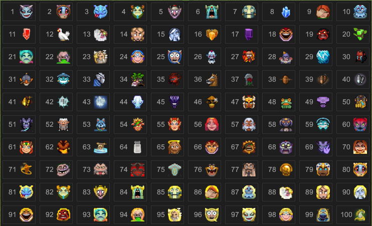
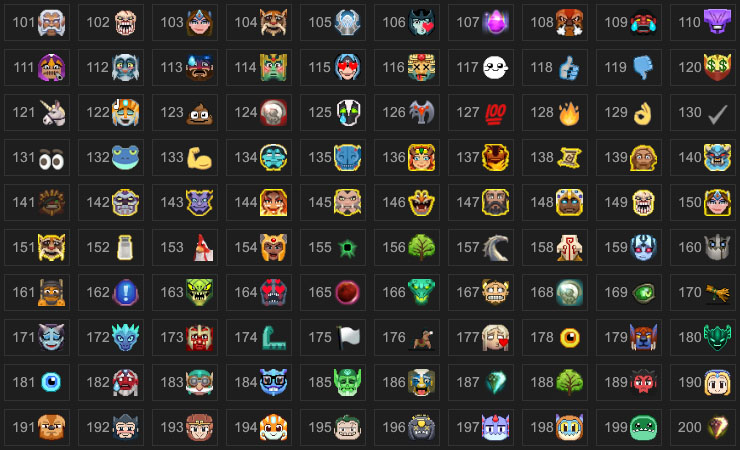

# DOTAEmoticon

Dota2表情，继承至Image

## 属性

| 属性名        | 类型      | 描述          |
| ------------- |:--------:| ------------- |
| emoticonid    | Integer  | 表情ID        |
| animating     | Boolean  | 是否播放动画   |
| alias         | String   | 使用表情的别名，也就是聊天框中的表情代号，如`:cocky:`，别名就是`cocky` |
| scaling       | String   | 伸缩方式       |

## 范例

写此文档时，刚好是200个表情




生成代码

XML
```xml
<Panel hittest="false" class="ExmpleRoot" >
	<Panel id="ExmpleFrame" >
	</Panel>
</Panel>
```

JS
```js
"use strict";

;(function(){
	var EmotionSchema = "<root><Panel style='margin:5px;flow-children:right;border: 1px solid #333;padding: 5px;'>" + 
						"<Label text='EID' style='vertical-align: middle;width:35px;text-align:center;color: #999;font-size:18px;'/>"+
						"<DOTAEmoticon id='icon' emoticonid='EID' animating='false' />" +
						"</Panel></root>";

	var panel = $.CreatePanel("Panel",$("#ExmpleFrame"),"");
	var index = 1;
	for (var i = 0; i < 20; i++) {
		for (var j = 0; j < 10; j++) {
			var emoticon = $.CreatePanel("Panel",panel,"");
			emoticon.BLoadLayoutFromString(EmotionSchema.replace(/EID/g,index++),false,false);
			if (index >= 101) return;
		}
		panel = $.CreatePanel("Panel",$("#ExmpleFrame"),"");
	}
})()
```

CSS
```css
.ExmpleRoot{
	width: 100%;
	height: 100%;
}

#ExmpleFrame {
	background-color: #1e1e1e;
	horizontal-align: center;
	vertical-align: middle;
	flow-children: down;
}
```