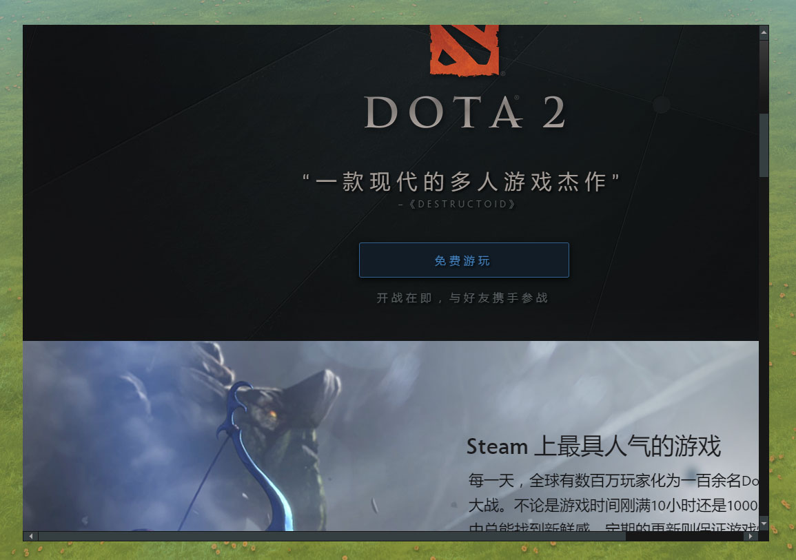

# DOTAHTMLPanel

网页浏览器，游戏内尽量不要使用内置浏览器，毕竟浏览器这玩意占用的内存是比较大的

## 属性

| 属性名        | 类型     | 描述  |
| ------------ |:---- ---:| ----- |
| url          | String   | 网址  |
| acceptsinput | Boolean  | 是否可以接受输入(键盘) |

## JS API

| 函数名           | 格式                             | 描述                  |
| --------------- | -------------------------------- | --------------------- |
| SetURL          | void SetURL(string url)               | 设置网址               |
| RunJavascript   | void RunJavascript(bool canRun)       | 是否可以运行Javascript |
| SetIgnoreCursor | void SetIgnoreCursor(bool ignore)     | 是否忽略鼠标           |

## 范例

```xml
<DOTAHTMLPanel style="width:1300px;height:900px;" url="http://dota2.com" />
```

