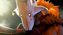
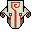

# DOTAHeroImage

英雄头像，用于显示英雄头像，继承至Image，可以用英雄的`HeroId`或`HeroName`来显示英雄的头像，而不必去读取英雄的头像路径。


## 属性

- XML属性

| 属性名         | 类型      | 描述  |
| -------------  |:--------:| ----- |
| heroname       | String  | 通过`HeroName`显示英雄的头像 |
| heroid         | String  | 通过`HeroId`显示英雄的头像 |
| heroimagestyle | String  | 显示样式，样式有`portrait`、`landscape`、`icon`，默认`landscape` |


- Javascript属性

| 属性名        | 类型      | 描述  |
| ------------- |:--------:| ----- |
| heroname      | String  | 通过`HeroName`显示英雄的头像 |
| heroid        | String  | 通过`HeroId`显示英雄的头像 |

## 范例

```xml
<DOTAHeroImage heroname="npc_dota_hero_juggernaut" heroimagestyle="portrait" />
<DOTAHeroImage heroname="npc_dota_hero_juggernaut" heroimagestyle="landscape" />
<DOTAHeroImage heroid="8" heroimagestyle="icon" />
```



