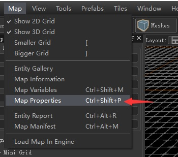
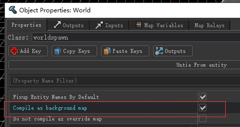
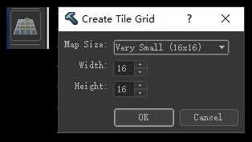
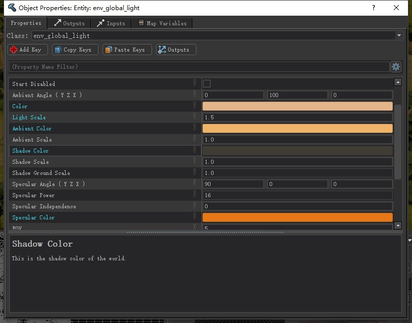
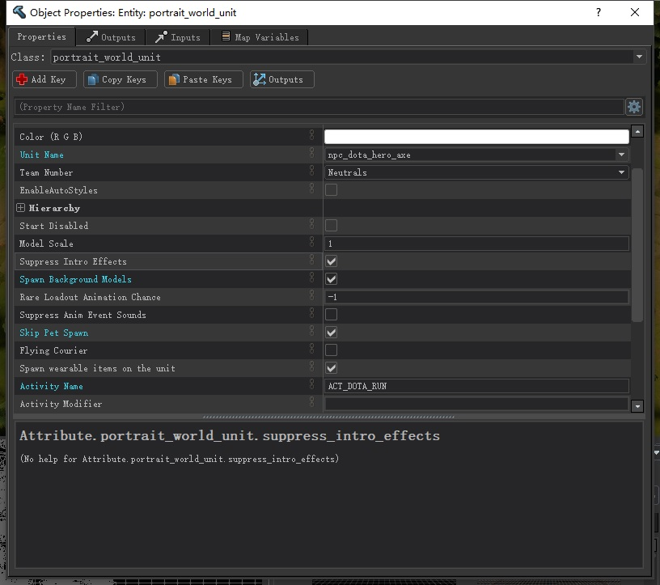
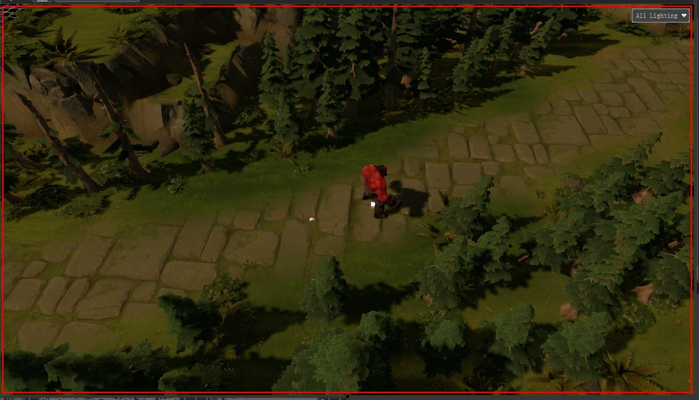
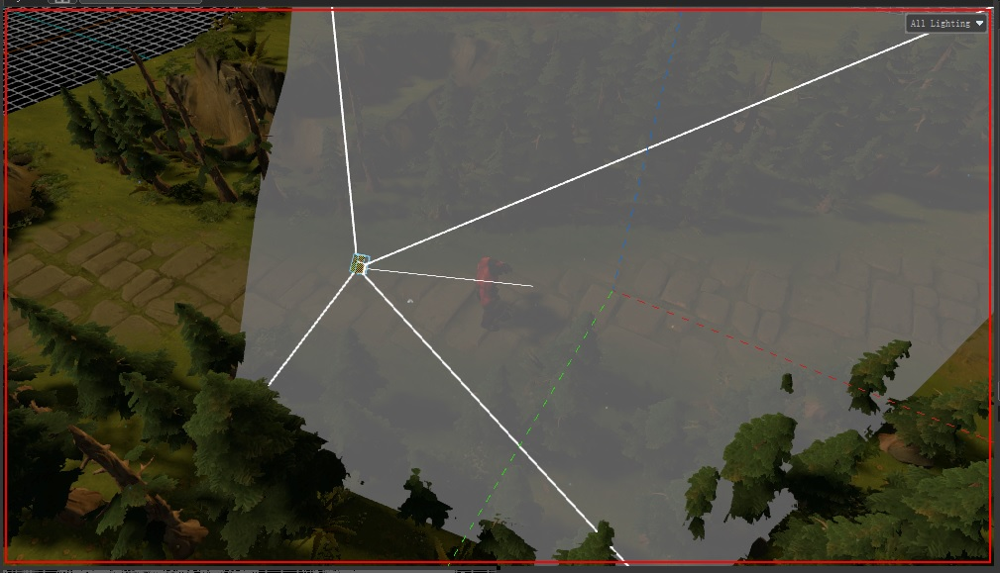
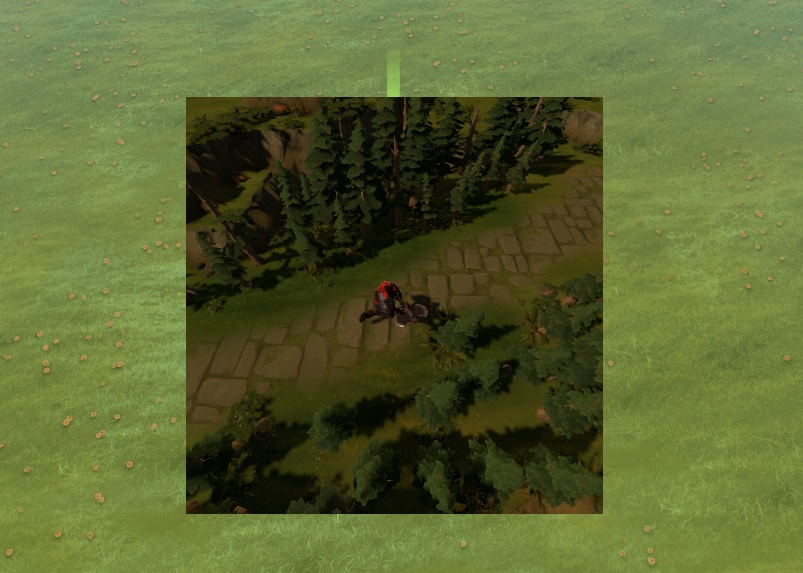
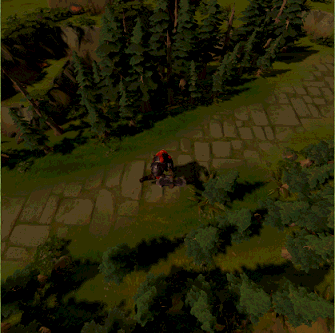

# DOTAScenePanel

场景组件，可以在UI中显示特效、模型、地形等，这是个功能强大的组件，也比较复杂，主要是Hammer块的内容需要花心思；
目前这个组件的效率不是很高，所以尽量少用大型的场景。

## 属性

| 属性名                     | 类型      | 描述  |
| -------------------------- | -------- | ----- |
| camera                     | String   | 镜头的实体名称(Name)，镜头实体使用`point_camera` |
| map                        | String   | 通常与camera配合使用，vmap路径，如`maps/scenes/effect_test.vpk`，则填`scenes/effect_test` |
| light                      | String   | 使用场景中的光照实体，比如创建一个`env_global_light`并设置`Name`为`global_light`,那么填light="global_light"，就是使用这个实体的光照|
| renderdeferred             | Boolean  | 延迟加载 |
| particleonly               | Boolean  | 只渲染特效，默认为true，true则无法正常渲染模型，地形等，只有特效正常显示，资源占用最小 |
| antialias                  | Boolean  | 是否开启抗锯齿 |
| rotateonhover              | Boolean  | 是否跟随鼠标做出偏转，自定义vmap无效 |
| yawmin                     | Float    | 向右偏转最小角度 |
| yawmax                     | Float    | 向左偏转最大角度 |
| pitchmin                   | Float    | 向下偏转最小角度 |
| pitchmax                   | Float    | 向上偏转最大角度 |
| acceleration               | Float    | 加速度 |
| panoramasurfacexml         | String   | 在场景中嵌入一个XML面板，目前不清楚这个面板如何显示出来 |
| panoramasurfacewidth       | String   | 嵌入的面板宽度 |
| panoramasurfaceheight      | String   | 嵌入的面板高度 |
| unit                       | String   | 单位名称，与map只能同时存在一个 |
| allowrotation              | Boolean  | 是否可以旋转场景，比如浏览Dota2英雄的时候鼠标滚轮转动英雄也会跟着转 |
| drawbackground             | Boolean  | 是否渲染背景 |
| activity-modifier          | String   | 初始动画? 目前只知道PostGameIdle |
| rendershadows              | Boolean  | 是否渲染阴影 |
| renderwaterreflections     | Boolean  | 是否渲染水中倒影 |
| environment                | String   | 默认是"default"，其定义在portraits.txt |

## JS API

```ts
// 触发实体的input，input值可以在V社的wiki查，比较新的实体可能没法查到，也可以在Hammer创建实体来查看
function DOTAScenePanel.FireEntityInput(string entityName, string input, string parameter): void;

// 如让特效实体重新播放，effect是实名名称
FireEntityInput("effect", "StopPlayEndCap", "1");
FireEntityInput("effect", "Start", "1");

// 使用调度事件函数
$.DispatchEvent("DOTAGlobalSceneFireEntityInput", "panelID", "effect", "Start", "1");
```


```ts
// 播放实体音效
function DOTAScenePanel.PlayEntitySoundEvent(string entityName, string soundEvent): void;

PlayEntitySoundEvent("effect","ui.courier_in_use");

// 使用调度事件函数
$.DispatchEvent( "PlaySoundEffect", "effect", "ui.courier_in_use" );
```

```ts
// 设置单位
// 第二参数未知，从效果来看，第二个参数应该是决定渲染单位的方式
// 因为设置单位之后，单位不是站在圆盘上面的，这跟默认的unit属性不一样
function DOTAScenePanel.SetUnit(string unitName, string a): void;

// 获取嵌入的面板(panoramasurfacexml)
function DOTAScenePanel.GetPanoramaSurfacePanel(): Panel;
```

## 制作场景

新建一个vmap，在顶部菜单栏依次选择`Map -> Map properties -> Compile as background map` 打钩，即可编译为UI可以使用的场景；
注意大部分实体在UI的场景中是无效的;

  



以下为常用实体

| 实体名                  | 描述                |
| ----------------------- | ------------------ |
| `portrait_world_unit`   | 显示一个单位或者英雄 |
| `point_camera`          | 镜头实体，创建镜头实体之后，你可能看不到这个实体，因为这个实体的Z轴特别大，在右边`Outliner`中选择你的镜头实体并修改Z轴到合适大小就可以看到，此外右键这个实体依次选择`Selected objects -> Attach To View`就可以将视角切换成镜头实体的视角，此时通过WASD移动就是移动镜头实体，按ESC退出绑定 |
| `env_global_light`      | 光照实体            |
| `info_particle_system`  | 特效实体            |

## 切换镜头

```js
// 1秒内切换到 EntityName 实体，实体必须是镜头实体(point_camera)
$.DispatchEvent( 'DOTAGlobalSceneSetCameraEntity', 'ScenePanelID', 'EntityName', 1.0 );
```

## 范例

制作一个斧王奔跑的场景，好吧，只能原地奔跑，这是一个权限问题，我们并不能去修改里面的实体位置，
因为客户端没有这些API，`DOTAScenePanel`除了特效可以动态调整位置以外其它的都无法调整

1. 打开`Hammer`新建一个vmap，并按照上面所说的勾选`Compile as background map`
2. 创建16x16的地形(点击Tile Editor)，然后你就可以随便画一点地形
3. 添加`env_global_light`实体，设置`Name`为`global_light`，如果你不知道怎么设置光照，可以复制`Prefabs`的`basic_entities.vmap`里面的`env_global_light`实体
4. 添加`portrait_world_unit`实体，<br>`Unit Name`填`npc_dota_hero_axe`，<br>`Activity Name`填`ACT_DOTA_RUN`
5. 添加`point_camera`实体，然后进行摆设
6. 最后保存为`scene_test.vmap`，并全编译
7. 在UI中使用

```xml
<DOTAScenePanel style="width:500px;height:500px;" light="global_light" camera="camera_1" map="scene_test" particleonly="false" antialias="true" />
```















最终效果：

