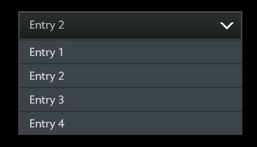

# DropDown

下拉菜单，通过下拉列表进行选择的UI。选择项为其子类。

## 属性

| 属性名        | 类型      | 描述  |
| -------------    |:--------:| ----- |
| initialselection | String   | 默认选择，需填子类的`id` |

## 事件

| 事件名        | 描述  |
| ------------------ | ---- |
| oninputsubmit      | 确定输入事件 |

## 范例

```xml
<DropDown id="MyDropDown" oninputsubmit="OnDropDownChanged()" initialselection="entry2">
    <Label text="Entry 1" id="entry1"/>
    <Label text="Entry 2" id="entry2"/>
    <Label text="Entry 3" id="entry3"/>
    <Label text="Entry 4" id="entry4"/>
</DropDown>
```
```JS
function OnDropDownChanged()
{
    var selected = $("#DropDown").GetSelected() //获取DropDown选择的子类
}
```

