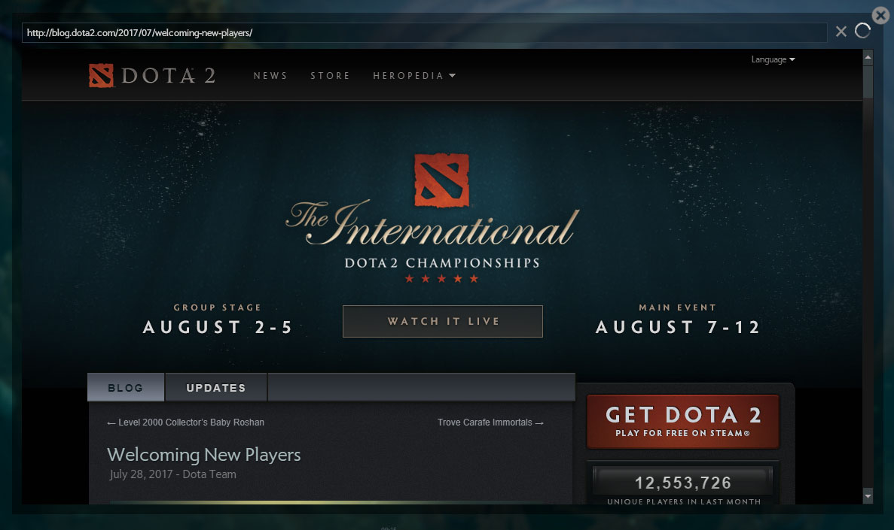

# HTML

网页浏览器，也就是DOTA2内置浏览器所使用的组件，这个组件在游戏中不建议使用，效率不是很高，游戏中使用`DOTAHTMLPanel`比较好

## 属性

| 属性名        | 类型     | 描述  |
| ------------ |:---- ---:| ----- |
| url          | String   | 网址  |
| acceptsinput | Boolean  | 是否可以接受输入(键盘) |

## JS API

| 函数名           | 格式                             | 描述                  |
| --------------- | -------------------------------- | --------------------- |
| SetURL          | SetURL(string url)               | 设置网址               |
| RunJavascript   | RunJavascript(bool canRun)       | 是否可以运行Javascript |
| SetIgnoreCursor | SetIgnoreCursor(bool ignore)     | 是否忽略鼠标           |

## 截图

