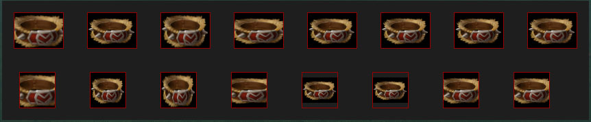

# Image

用于显示图片，支持图片格式`png,tga,psd,jpg`，`gif`格式虽然也支持，但是不支持透明而且也无法编译。

## 属性

| 属性名        | 类型      | 描述  |
| ------------ |:--------:| ----- |
| src          | String   | 图片路径 |
| scaling      | String   | 定义图片的伸缩方式 |

## 路径

1. 一般是把图片存放在`dota 2 beta\content\dota_addons\YourAddon\panorama\images\custom_game`；
custom_game目录是自定义游戏使用的，因为上一级目录中存放了大量的Dota2图片，为了不冲突尽量放在这个目录，你可以通过放置同路径的图片来覆盖自带的图片；

1. 在使用时填`file://{images}/custom_game/xxxxx.png`，此时运行你的游戏，如果使用到了这张图片，系统会自动编译到`dota 2 beta\game\dota_addons\YourAddon\panorama\images`，此时就可以在相应目录看到类似`xxxxx_png.vtex_c`这样的文件；

1. 直接使用编译后的图片`s2r://panorama/images/xxxxx_png.vtex_c`；

1. 当然我们也可以直接使用没有编译的图片，比如技能图标和物品图标就是直接使用原图`raw://resource/flash3/images/spellicons/AbilityName.png`

1. 此外也可以从HTTP中获得图片`http://exmple.com/xxxx.png`

## 编译注意事项

- 图片格式尽量使用`png`，目前这个格式支持是最完美的，`psd`会产生一些莫名其妙的渲染问题，其它格式问题不大且不怎么常用

- 直接在XML中使用`<Image src="file://">`和在CSS中使用`background-image:url("file://")`都会自动编译，通过JS的`SetImage()`API是无法自动编译的

## 伸缩

支持一下几种：
- none (无，直接显示原始大小)
- stretch (默认)
- stretchx (只伸缩宽度)
- stretchy (只伸缩高度)
- stretch-to-fit-preserve-aspect （裁剪）
- stretch-to-fit-x-preserve-aspect （只裁剪宽度）
- stretch-to-fit-y-preserve-aspect （只裁剪高度）
- stretch-to-cover-preserve-aspect （裁剪至合适宽高）

默认情况下，图片会自动根据父Panel的大小来自动伸缩，如果父Panel宽高超过图片宽高，图片将显示原有宽高

## 范例

物品图标规格是88x64，第一行是正常规格，第二行是64x64



XML
```xml
<Panel hittest="false" class="ExmpleRoot" >
	<Panel id="ExmpleFrame" >
		<!-- 第一行 -->
		<Panel class="one">
			<Image src="raw://resource/flash3/images/items/belt_of_strength.png" scaling="none" />
			<Image src="raw://resource/flash3/images/items/belt_of_strength.png" />
			<Image src="raw://resource/flash3/images/items/belt_of_strength.png" scaling="stretchx" />
			<Image src="raw://resource/flash3/images/items/belt_of_strength.png" scaling="stretchy" />
			<Image src="raw://resource/flash3/images/items/belt_of_strength.png" scaling="stretch-to-fit-preserve-aspect" />
			<Image src="raw://resource/flash3/images/items/belt_of_strength.png" scaling="stretch-to-fit-x-preserve-aspect" />
			<Image src="raw://resource/flash3/images/items/belt_of_strength.png" scaling="stretch-to-fit-y-preserve-aspect" />
			<Image src="raw://resource/flash3/images/items/belt_of_strength.png" scaling="stretch-to-cover-preserve-aspect" />
		</Panel>
		<!-- 第二行 -->
		<Panel class="two">
			<Image src="raw://resource/flash3/images/items/belt_of_strength.png" scaling="none" />
			<Image src="raw://resource/flash3/images/items/belt_of_strength.png" />
			<Image src="raw://resource/flash3/images/items/belt_of_strength.png" scaling="stretchx" />
			<Image src="raw://resource/flash3/images/items/belt_of_strength.png" scaling="stretchy" />
			<Image src="raw://resource/flash3/images/items/belt_of_strength.png" scaling="stretch-to-fit-preserve-aspect" />
			<Image src="raw://resource/flash3/images/items/belt_of_strength.png" scaling="stretch-to-fit-x-preserve-aspect" />
			<Image src="raw://resource/flash3/images/items/belt_of_strength.png" scaling="stretch-to-fit-y-preserve-aspect" />
			<Image src="raw://resource/flash3/images/items/belt_of_strength.png" scaling="stretch-to-cover-preserve-aspect" />
		</Panel>
	</Panel>
</Panel>
```

CSS

```css
.ExmpleRoot{
	width: 100%;
	height: 100%;
}

#ExmpleFrame {
	background-color: #1e1e1e;
	horizontal-align: center;
	vertical-align: middle;
	flow-children: down;
}

#ExmpleFrame > Panel {
	flow-children: right;
}

#ExmpleFrame > Panel.one Image{
	width: 88px;
	height: 64px;
	margin: 20px;
	border: 1px solid #900;
}

#ExmpleFrame > Panel.two Image{
	width: 64px;
	height: 64px;
	margin: 20px 30px;
	border: 1px solid #900;
}
```